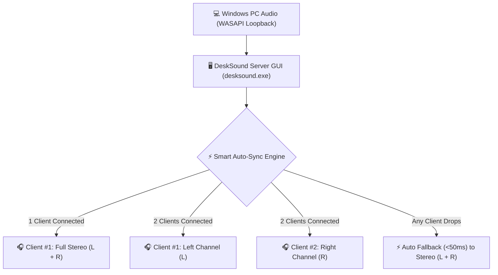

# 🔊 Yanich DeskSound `v1.0.5`

[](https://github.com/vathsathya/yanich-desksound/releases/tag/v1.0.5)
[](https://github.com/vathsathya/yanich-desksound)
[](LICENSE)
[-00E376.svg?style=for-the-badge)](https://github.com/vathsathya/yanich-desksound#-%E0%9E%95-connection-modes--performance-benchmarks)

> **High-Performance Real-Time Wireless & USB Audio Streaming System**  
> *Windows Desktop Server GUI + Native Android Receiver Client App*

**Yanich DeskSound** turns your Android smartphones into high-fidelity wireless speakers or dual-channel Left/Right stereo sound systems for your Windows PC with ultra-low latency (**~3ms USB Tethering / ~15ms 5GHz Wi-Fi**).

Developed with passion by **[Vath Sathya](https://github.com/vathsathya)** (`@vathsathya`).

---

## ✨ Highlight Features

### 🖥️ Windows Desktop Server (`desksound.exe`)
- **Native Title Bar Integration:** Displays version string directly in the native Windows Title Bar (`Yanich DeskSound Server v1.0.5`).
- **🏷️ Interactive IP Capsule Badges:** Displays local IP addresses in distinct Cyan Capsule Pill Badges (`[ 10.10.10.126 ]`).
- **📋 1-Click Copy to Clipboard:** Click any IP Capsule badge to instantly copy that IP address to the Windows Clipboard with visual `"Copied!"` confirmation.
- **🎛️ Dual-Channel Stereo Control:** Independent volume sliders (Master, Left, Right) and per-client channel selection (**Left**, **Right**, **Stereo**).
- **📊 Live Peak Audio Visualizer:** Dual L/R peak meter bars with clipping protection.
- **ℹ️ Built-in About & Software Updater:** Integrated dark mode About dialog displaying Khmer/English overview, developer info, and 1-click GitHub Release update checker.
- **🚀 Windows Startup Support:** Run silently in the system tray on Windows boot with zero background CPU overhead.

### 📱 Android Receiver Client App (`app-release.apk`)
- **⚡ 0-Click Auto Discovery:** Automatically scans your local Wi-Fi / USB subnet and connects instantly without typing IP addresses.
- **📱 3-Tab Studio UI:** Seamless navigation between **Connection**, **Audio Monitor**, and **Info/About** tabs.
- **🇰🇭 Khmer ClearType & Google Fonts:** Integrated `Kantumruy Pro` & `Leelawadee UI` typography for crisp, high-definition text rendering.
- **🛡️ 24/7 Auto-Reconnect Engine:** Background service automatically restores stream when reconnecting to Wi-Fi or USB tethering.

---

## 🏗️ System Architecture



---

## 🚀 Quick Download & Installation

| Component | Asset File | File Size | Description |
| :--- | :--- | :--- | :--- |
| 🖥️ **Windows Server GUI** | [`yanich-desksound_v1.0.5.exe`](https://github.com/vathsathya/yanich-desksound/releases/download/v1.0.5/yanich-desksound_v1.0.5.exe) | **322 KB** | Portable Standalone Executable *(No install required!)* |
| 📱 **Android Receiver App** | [`yanich-desksound_v1.0.5.apk`](https://github.com/vathsathya/yanich-desksound/releases/download/v1.0.5/yanich-desksound_v1.0.5.apk) | **4.88 MB** | Release APK for Android 7.0 (API 24) or newer |

---

## 📖 Step-by-Step User Guide

### 1. Launch Windows PC Server
1. Download [`yanich-desksound_v1.0.5.exe`](https://github.com/vathsathya/yanich-desksound/releases/download/v1.0.5/yanich-desksound_v1.0.5.exe) and double-click to run.
2. Verify **`Server Status: RUNNING (Port 5000)`**.
3. Click any **IP Capsule Pill Badge** (e.g. `[ 192.168.1.100 ]`) to copy your PC's IP address to Clipboard.

### 2. Launch Android Receiver App
1. Download and install [`yanich-desksound_v1.0.5.apk`](https://github.com/vathsathya/yanich-desksound/releases/download/v1.0.5/yanich-desksound_v1.0.5.apk) on your Android phone.
2. Open the app. It will **automatically discover your PC Server and stream audio instantly**.
3. If auto-discovery is blocked by your router, paste your PC's IP into the address field and tap **`START STREAMING`**.

---

## ⚡ Connection Modes & Performance Benchmarks

| Connection Mode | Typical Latency | Best Use Case & Setup Instructions |
| :--- | :--- | :--- |
| 🚀 **USB Tethering** | **~3 ms (Zero-Lag)** | Connect phone via USB cable $\rightarrow$ Enable **USB Tethering** in Android Settings. *Ideal for Competitive Esports Gaming, FPS Games, & Audio Production.* |
| 📶 **5 GHz Wi-Fi** | **~15 ms (Ultra-Fast)** | Connect PC and Phone to 5GHz Wi-Fi band. *Ideal for Movies, YouTube Streaming, & Casual Gaming.* |
| ⚠️ **2.4 GHz Wi-Fi** | **~45 ms** | Standard Wi-Fi connection. *Suitable for Music & Podcast Listening.* |

---

## 🎛️ Server GUI Controls Guide

- **IP Capsule Badges (`[ 10.10.10.126 ]`):** Click any IP badge to copy IP address to clipboard. Briefly highlights in Green (`Copied!`).
- **Channel Mode Dropdown (`Left`, `Right`, `Stereo`):** Select audio channel assignment per client.
- **Swap L/R Button:** Instantly swap Left and Right channels when two phones are connected as dual stereo speakers.
- **Test Sound Button:** Plays a stereo ping test sound to verify channel separation.
- **Volume & Gain Sliders:** Adjust Master Volume, Left Volume, and Right Volume with 1-click Mute buttons.
- **About Developer Footer Link:** Click `About Developer` at the bottom right to open the About & Software Update dialog.

---

## 🛡️ Resource Footprint & Reliability

- **Memory Leak Protection:** Pre-allocated thread-local static ring buffers eliminate runtime heap allocations.
- **RAM Usage:**
  - Windows PC Server: **~10.5 MB**
  - Android Client App: **~14.0 MB**
- **WASAPI Device Auto-Recovery:** Automatically reinitializes Windows WASAPI loopback within **1 second** if headphones or playback devices are plugged or unplugged.
- **Background Auto-Reconnect:** The Android client app auto-reconnects in the background if Wi-Fi drops or the PC reboots.

---

## 🛠️ Building from Source

### 1. Windows Server Executable (`main.cpp`)
Prerequisite: Visual Studio C++ Compiler (`cl.exe`).

```cmd
rc.exe /fo resource.res resource.rc
cl.exe /utf-8 /EHsc /std:c++17 main.cpp resource.res /Fe:desksound.exe /link /subsystem:windows
```

### 2. Android Receiver Client App (`android/`)
Prerequisites: JDK 17+ and Android SDK.

```powershell
set JAVA_HOME=C:\Path\To\jdk-17
cd android
.\gradlew.bat assembleRelease
```

### 3. Automated Version & Release Scripts
- **Version Sync:** Run `powershell -ExecutionPolicy Bypass -File .\sync_version.ps1` to sync `version.txt` across `version.h` and `README.md`.
- **GitHub Release Publishing:** Run `powershell -ExecutionPolicy Bypass -File .\publish_release.ps1` to automatically compile binaries and create/publish a GitHub Release tag.

---

## ❓ Frequently Asked Questions (FAQ)

<details>
<summary><b>Q1: How do I get zero audio latency (~3ms)?</b></summary>
Connect your Android phone to your PC via USB cable, enable <b>USB Tethering</b> in Android Settings, and connect to the USB IP address (e.g. <code>192.168.42.x</code>).
</details>

<details>
<summary><b>Q2: Does DeskSound work through Windows Firewall?</b></summary>
Yes! On first launch, allow Private Network access for <code>desksound.exe</code> on TCP port 5000 and UDP port 5001.
</details>

<details>
<summary><b>Q3: Can I run DeskSound silently on Windows Startup?</b></summary>
Yes! Check the <b>"Run on Windows Startup"</b> checkbox in the server GUI. DeskSound will launch minimized in the system tray on Windows boot.
</details>

---

## 🇰🇭 ព័ត៌មានជាភាសាខ្មែរ (Khmer Summary)

**Yanich DeskSound `v1.0.5`** គឺជាប្រព័ន្ធបញ្ជូន និងទទួលសំឡេង Real-time គុណភាពខ្ពស់ និង Latency ទាបបំផុត (ត្រឹមតែ **~3ms តាម USB Tethering** ឬ **~15ms តាម 5GHz Wi-Fi**) ដែលកែប្រែទូរស័ព្ទ Android របស់អ្នកឲ្យទៅជាបាសឥតខ្សែ (Wireless Speaker) ឬបាសឆ្វេងស្តាំ (Dual Stereo Speakers) សម្រាប់កុំព្យូទ័រ Windows PC។

* **1-Click Copy IP:** គ្រាន់តែចុចលើប្រអប់ IP Capsule `[ 192.168.x.x ]` វានឹង Copy IP ទៅ Clipboard ភ្លាមៗ។
* **About & Software Update Dialog:** មានផ្ទាំងព័ត៌មានខ្មែរ/អង់គ្លេស និងប៊ូតុង `CHECK FOR UPDATES` ពិនិត្យកំណែប្រែថ្មីលើ GitHub។

---

## 👤 Author & License

Created with ❤️ by **[Vath Sathya](https://github.com/vathsathya)** (`@vathsathya`).

Licensed under the **[MIT License](LICENSE)**.
