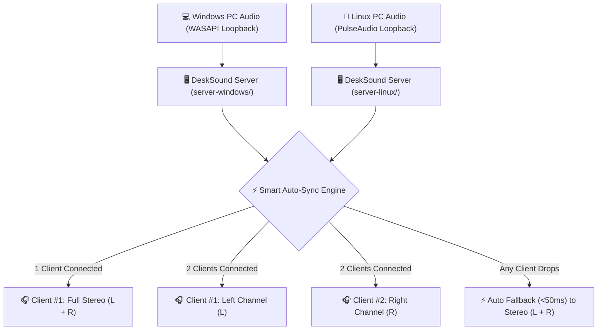

# 🔊 Yanich DeskSound `v1.2.1`

[](https://github.com/vathsathya/yanich-desksound/releases/tag/v1.2.1)
[](https://github.com/vathsathya/yanich-desksound)
[](LICENSE)
[-00E376.svg?style=for-the-badge)](https://github.com/vathsathya/yanich-desksound)

> **High-Performance Real-Time Wireless & USB Audio Streaming System**  
> *Windows & Linux Desktop Server GUI + Native Android Receiver Client App*

**Yanich DeskSound** turns your Android smartphones into high-fidelity wireless speakers or dual-channel Left/Right stereo sound systems for your PC with ultra-low latency (**~2.6ms USB Tethering / ~15ms 5GHz Wi-Fi**).

Developed with passion by **[Vath Sathya](https://github.com/vathsathya)** (`@vathsathya`).

---

## ✨ Highlight Features

### 🖥️ Windows & Linux Desktop Servers (`server-windows/` & `server-linux/`)
- **🎛️ Ultra-Low Latency Buffer Tuning (128 - 2048 Samples):** Choose from **128 samples (~2.6ms, Instant)**, **256 samples (~5.3ms)**, **512 samples (~10.6ms)**, **1024 samples (~21.3ms, Default)**, or **2048 samples (~42.6ms)** for instant audio response.
- **🎨 Modern Sharp Rectangular & Borderless UI:** Clean borderless GTK3 interface with zero rounded corner distractions, native GNOME HIG architecture, and instant visual feedback.
- **⏹/▶ Compact Square Icon Toggle Button:** Instant 26×26px square server toggle action button with `⏹` (Stop) / `▶` (Start) state icons and hover tooltips.
- **📊 Real-Time Dual Latency & Bitrate Diagnostics:** Transparent status badge showing live streaming bitrate, PulseAudio capture buffer latency, and total estimated end-to-end network latency (`Bitrate: ~1.5 Mbps | Buf: ~2.6ms | Total: ~15ms`).
- **📋 REAL-TIME LOG VIEW DIALOG:** Live activity log viewer window with timestamps (`[HH:MM:SS]`), socket events, client IP connections, and 1-click **COPY LOGS** / **CLEAR** actions.
- **✨ OPTIMIZE VOLUME (Anti-Distortion & Peak Attenuation):** Real-time peak compression dynamically lowers loud sound bursts to prevent speaker crackling or audio distortion.
- **🛡️ UDP Auto-Discovery Server Matching:** Automatically responds to Android UDP discovery requests (`DESKSOUND_DISCOVER`) on port 5001 within <1 second.
- **⚡ 128 KB High-Performance Socket Buffer:** Configured with `TCP_NODELAY`, `TCP_QUICKACK`, and 128 KB socket send buffer for zero packet jitter.
- **📋 1-Click Copy to Clipboard:** Click any IP Capsule badge to instantly copy that IP address to the Clipboard with visual `"Copied!"` confirmation.
- **☑️ 'Minimize to tray' & Auto-Start:** Preferences to toggle whether closing the window hides it into the system tray or exits completely, plus automatic launch on system login.
- **🎛️ Dual-Channel Stereo Control:** Independent volume sliders (Master, Left, Right) and per-client channel selection (**Left**, **Right**, **Stereo**).
- **📊 Live Peak Audio Visualizer:** Dual L/R peak meter bars with clipping protection.

### 📱 Android Receiver Client App (`app-release.apk`)
- **⚡ 0-Click Auto Discovery:** Automatically scans your local Wi-Fi / USB subnet and connects instantly without typing IP addresses.
- **📱 3-Tab Studio UI:** Seamless navigation between **Connection**, **Audio Monitor**, and **Info/About** tabs.
- **🇰🇭 Khmer ClearType & Google Fonts:** Integrated `Kantumruy Pro` & `Leelawadee UI` typography for crisp, high-definition text rendering.
- **🔋 High-Performance WifiLock & WakeLock:** Prevents Android OS Doze mode / battery saver from throttling Wi-Fi packets when screen turns off.
- **🛡️ 24/7 Auto-Reconnect Engine:** Background service automatically restores stream when reconnecting to Wi-Fi or USB tethering.

---

## 🏗️ System Architecture



---

## 🚀 Downloads & User Guide

### 📦 Latest Release Assets

| Component | Asset File | File Size | Description |
| :--- | :--- | :--- | :--- |
| 🐧 **Linux Production Package** | [`yanich-desksound_v1.2.1-linux-x64.tar.gz`](https://github.com/vathsathya/yanich-desksound/releases/download/v1.2.1/yanich-desksound_v1.2.1-linux-x64.tar.gz) | **~800 KB** | Linux Desktop Installer Package *(App Launcher Shortcut + Binary)* |
| 🐧 **Linux Standalone Binary** | [`yanich-desksound_v1.2.1-linux-x64`](https://github.com/vathsathya/yanich-desksound/releases/download/v1.2.1/yanich-desksound_v1.2.1-linux-x64) | **2.2 MB** | Portable Executable *(Direct run without installation)* |
| 🖥️ **Windows Server GUI** | [`yanich-desksound_v1.0.15.exe`](https://github.com/vathsathya/yanich-desksound/releases/download/v1.0.15/yanich-desksound_v1.0.15.exe) | **322 KB** | Portable Standalone Executable *(No install required!)* |
| 📱 **Android Receiver App** | [`yanich-desksound_v1.0.15.apk`](https://github.com/vathsathya/yanich-desksound/releases/download/v1.0.15/yanich-desksound_v1.0.15.apk) | **4.88 MB** | Release APK for Android 7.0 (API 24) or newer |

---

### 🐧 Linux Server User Guide

#### Option A: Quick Production Installation (App Launcher Integration)
1. Download `yanich-desksound_v1.2.1-linux-x64.tar.gz` from Releases.
2. Extract the archive and run the installer:
```bash
tar -xzf yanich-desksound_v1.2.1-linux-x64.tar.gz
cd yanich-desksound_v1.2.1-linux-x64
bash install.sh
```
3. Search for **"Yanich DeskSound"** in your Linux Desktop Application Launcher / Start Menu (Ubuntu, GNOME, KDE, Linux Mint, Fedora) and click to launch!

To uninstall cleanly at any time:
```bash
bash uninstall.sh
```

#### Option B: Portable Execution (No Installation Required)
1. Download `yanich-desksound_v1.2.1-linux-x64`.
2. Make it executable and run directly from anywhere:
```bash
chmod +x yanich-desksound_v1.2.1-linux-x64
./yanich-desksound_v1.2.1-linux-x64
```

---

## 📖 Master Build & CLI Commands

- **Linux Build & Package Pipeline:** Run `bash scripts/build_linux.sh` in the root folder to compile Linux Server, build `.tar.gz` production installer package, and generate standalone binaries.
- **Linux GitHub Release Publisher:** Run `bash scripts/publish_release_linux.sh` to automatically build, package, and upload Linux release assets to GitHub Releases.
- **Windows Build Pipeline:** Run `build.bat` in the root folder to compile Windows Server, build Android APK, update Git tag, and publish to GitHub Releases.

---

## 👤 Author & License

Created with ❤️ by **[Vath Sathya](https://github.com/vathsathya)** (`@vathsathya`).

Licensed under the **[MIT License](LICENSE)**.
