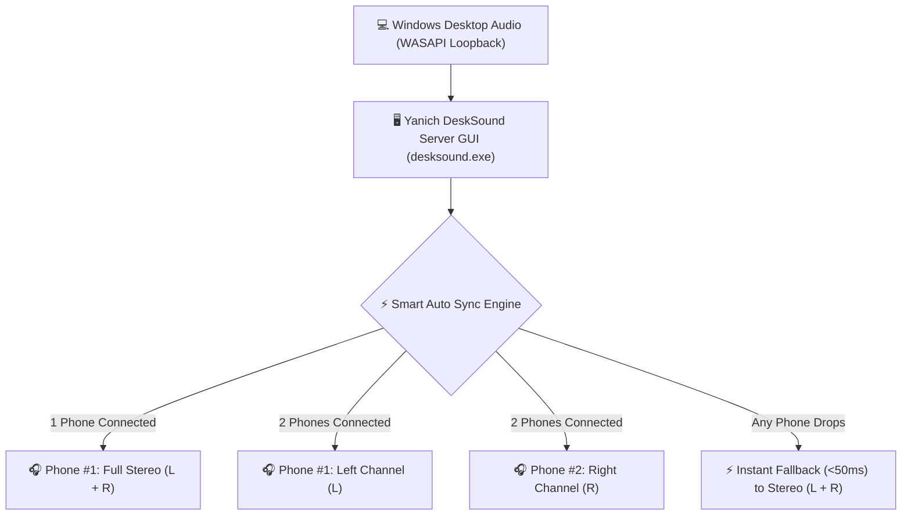

# 🔊 Yanich DeskSound `v1.0.5`

[](https://github.com/vathsathya/yanich-desksound/releases/tag/v1.0.5)
[](https://github.com/vathsathya/yanich-desksound)
[](LICENSE)

> **Ultra-Low Latency Desktop Audio Streaming System (Windows PC Server GUI + Native Android Receiver App)**

**Yanich DeskSound** turns your Android smartphones into high-definition wireless speakers or dual-channel Left/Right stereo sound systems for your Windows PC with ultra-low latency (**~3ms USB Tethering / ~15ms 5GHz Wi-Fi**).

Created by **Vath Sathya**.

---

## 🏗️ System Architecture



---

## 🚀 Quick Download & Install

| Component | File | Size | Description |
| :--- | :--- | :--- | :--- |
| 🖥️ **Windows Server GUI** | [`desksound.exe`](https://github.com/vathsathya/yanich-desksound/raw/main/desksound.exe) | **318 KB** | Portable Standalone Executable *(No installation needed!)* |
| 📱 **Android Receiver App** | [`app-release.apk`](https://github.com/vathsathya/yanich-desksound/raw/main/app-release.apk) | **4.88 MB** | Release APK for Android 7.0+ |

---

## 📖 Step-by-Step User Guide

### Step 1: Start Windows PC Server
1. Download and double-click **`desksound.exe`**.
2. Verify the indicator says **`Server Status: RUNNING (Port 5000)`**.
3. Note down your PC's Local IP Address displayed on screen (e.g., `192.168.1.100` or `192.168.42.x`).

### Step 2: Open Android Receiver App
1. Download and install **`app-release.apk`** on your Android smartphone.
2. Launch the app. It will **automatically scan your network and connect instantly (0 Clicks Required!)**.
3. Audio will start playing immediately through your phone's speaker or plugged headphones!

---

## ⚡ Connection Modes & Performance Guide

| Mode | Typical Latency | Setup Guide |
| :--- | :--- | :--- |
| 🚀 **USB Tethering** | **~3ms (Zero-Lag)** | Connect phone via USB -> Enable **USB Tethering** in Android Settings. Best for Esports Gaming & Audio Production. |
| 📶 **5 GHz Wi-Fi** | **~15ms (Ultra-Fast)** | Connect both PC & Phone to 5GHz Wi-Fi band. Best for Movies & Daily Use. |
| ⚠️ **2.4 GHz Wi-Fi** | **~45ms** | Standard Wi-Fi connection. |

---

## 🎧 Per-Client Channel & Master Controls Guide

### 1. Channel Assignment & Selection
- **Independent Channel Selector**: Select **`Left`**, **`Right`**, or **`Stereo`** for each client individually right next to its Disconnect button.
- **Default Assignment**:
  - **Client #1**: Set to **Left Channel (L)** by default.
  - **Client #2**: Set to **Right Channel (R)** by default.

### 2. Windows PC Master Controls (`desksound.exe`)
- 🎧 **`Left` / `Right` / `Stereo`**: 1-click channel toggle buttons for each connected client.
- 🔴 **`Disconnect`**: Disconnect/Kick any client row directly from the server screen.

### 3. Volume & Channel Gain Controls
- **Master Volume**: Smooth 0% to 100% volume slider.
- **Left (L) & Right (R) Gain Sliders**: Independent channel gain tuning (**-10dB to +10dB**).
- **Step Buttons**: `-10`, `+10`, `-2dB`, `+2dB`, `Reset`.
- **Hardware Protection Limiter**: Strict 0%–100% boundary limit with IEEE 32-bit Float PCM clipping protection to protect phone speakers.

---

## 🛡️ 24/7 Long-Term Reliability & Resource Usage

- **0% Memory Leak**: Pre-allocated thread-local static buffers eliminate heap allocation during streaming.
- **Resource Footprint**:
  - Windows Server RAM: **~10.5 MB**
  - Android App RAM: **~14.0 MB**
- **24/7 WASAPI Auto-Recovery**: If audio devices or headphones are unplugged/changed on Windows, the server auto-reinitializes WASAPI within **1 second** without crashing.
- **Persistent Auto-Reconnect**: If Wi-Fi drops or the PC reboots, the Android app enters background auto-reconnect mode and restores playback automatically when the PC comes back online.

---

## ❓ Frequently Asked Questions (FAQ) & Troubleshooting

<details>
<summary><b>Q1: Why is there audio delay on 2.4GHz Wi-Fi?</b></summary>
2.4GHz Wi-Fi networks suffer from Bluetooth interference and network congestion. Switch your Wi-Fi router to <b>5GHz Wi-Fi</b> (~15ms) or connect via <b>USB Tethering</b> (~3ms) for zero delay.
</details>

<details>
<summary><b>Q2: Does DeskSound work when Windows Firewall is on?</b></summary>
Yes! On first launch, if Windows Firewall prompts for access, allow <b>Private Networks</b> access for <code>desksound.exe</code> on TCP port 5000 and UDP port 5001.
</details>

<details>
<summary><b>Q3: Can I run DeskSound silently on Windows Startup?</b></summary>
Yes! Check the <b>"Run on Windows Startup"</b> checkbox in the server GUI. DeskSound will launch silently into the system tray when Windows boots.
</details>

---

## 🛠️ Building from Source

### 1. Windows Server GUI (`main.cpp`)
Prerequisites: Visual Studio C++ Compiler (`cl.exe`).

```cmd
rc.exe /fo resource.res resource.rc
cl.exe /EHsc /std:c++17 main.cpp resource.res /Fe:desksound.exe /link /subsystem:windows
```

### 2. Android Receiver App (`android/`)
Prerequisites: JDK 17+ and Android SDK.

```powershell
cd android
.\gradlew.bat assembleRelease
```

---

## 👤 Author & License

**Created by Vath Sathya**

Released under the **MIT License**.
