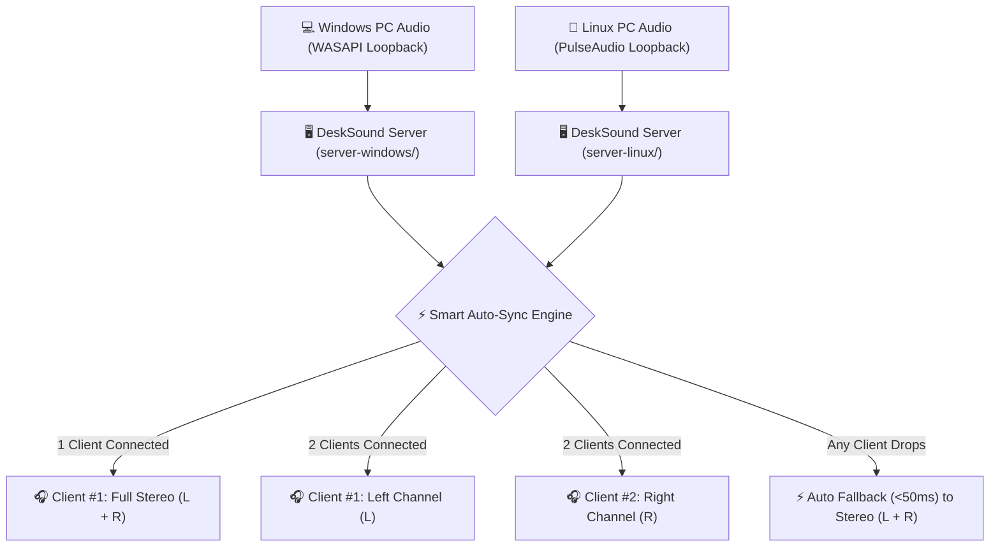

# 🔊 Yanich DeskSound `v1.0.8`

[-00E376.svg?style=for-the-badge)](https://github.com/vathsathya/yanich-desksound#-%E0%9E%95-connection-modes--performance-benchmarks)

> **High-Performance Real-Time Wireless & USB Audio Streaming System**  
> *Windows & Linux Desktop Server GUI + Native Android Receiver Client App*

**Yanich DeskSound** turns your Android smartphones into high-fidelity wireless speakers or dual-channel Left/Right stereo sound systems for your PC with ultra-low latency (**~3ms USB Tethering / ~15ms 5GHz Wi-Fi**).

Developed with passion by **[Vath Sathya](https://github.com/vathsathya)** (`@vathsathya`).

---

## ✨ Highlight Features

### 🖥️ Windows & Linux Desktop Servers (`server-windows/` & `server-linux/`)
- **Native Title Bar Integration:** Displays version string directly in the native Windows Title Bar (`Yanich DeskSound Server v1.0.8`).
- **🛡️ Private Subnet Security Hardening:** Restricts UDP discovery listeners to private local IP subnets to prevent unauthorized eavesdropping.
- **⚡ 128 KB High-Performance Socket Buffer:** Configured with `TCP_NODELAY` and 128 KB socket buffer for zero packet jitter.
- **🏷️ Non-Overlapping IP Capsule Badges:** Displays local IP addresses in distinct Cyan Capsule Pill Badges (`[ 10.10.10.126 ]`) with zero text/border collisions.
- **📋 1-Click Copy to Clipboard:** Click any IP Capsule badge to instantly copy that IP address to the Windows Clipboard with visual `"Copied!"` confirmation.
- **👆 Hand Cursor (`IDC_HAND`) Micro-Interactions:** Custom hand cursor feedback when hovering over IP Capsules, buttons, volume sliders, and dropdown menus.
- **☑️ 'Minimize to tray' Checkbox Option:** Custom checkbox preference to toggle whether closing the window hides it into the system tray or exits completely.
- **🎛️ Dual-Channel Stereo Control:** Independent volume sliders (Master, Left, Right) and per-client channel selection (**Left**, **Right**, **Stereo**).
- **📊 Live Peak Audio Visualizer:** Dual L/R peak meter bars with clipping protection.
- **🚀 Windows Startup & Silent Mode:** Run silently in the system tray on Windows boot (`-silent` / `-service`) with zero background CPU overhead.

### 📱 Android Receiver Client App (`app-release.apk`)
- **⚡ 0-Click Auto Discovery:** Automatically scans your local Wi-Fi / USB subnet and connects instantly without typing IP addresses.
- **📱 3-Tab Studio UI:** Seamless navigation between **Connection**, **Audio Monitor**, and **Info/About** tabs.
- **🇰🇭 Khmer ClearType & Google Fonts:** Integrated `Kantumruy Pro` & `Leelawadee UI` typography for crisp, high-definition text rendering.
- **🔋 High-Performance WifiLock & WakeLock:** Prevents Android OS Doze mode / battery saver from throttling Wi-Fi packets when screen turns off.
- **🛡️ 24/7 Auto-Reconnect Engine:** Background service automatically restores stream when reconnecting to Wi-Fi or USB tethering.

---

## 🏗️ System Architecture

---

## 🚀 Quick Download & Installation

| Component | Asset File | File Size | Description |
| :--- | :--- | :--- | :--- |
| 🖥️ **Windows Server GUI** | [`yanich-desksound_v1.0.8.exe`](https://github.com/vathsathya/yanich-desksound/releases/download/v1.0.8/yanich-desksound_v1.0.8.exe) | **322 KB** | Portable Standalone Executable *(No install required!)* |
| 📱 **Android Receiver App** | [`yanich-desksound_v1.0.8.apk`](https://github.com/vathsathya/yanich-desksound/releases/download/v1.0.8/yanich-desksound_v1.0.8.apk) | **4.88 MB** | Release APK for Android 7.0 (API 24) or newer |

---

## 📖 Master Build & CLI Commands

- **Windows Build Pipeline:** Run `build.bat` in the root folder to compile Windows Server, build Android APK, update Git tag, and publish to GitHub Releases.
- **Linux Build Pipeline:** Run `bash build.sh` in the root folder to compile Linux Server, build Android APK, update Git tag, and publish to GitHub Releases.

---

## 👤 Author & License

Created with ❤️ by **[Vath Sathya](https://github.com/vathsathya)** (`@vathsathya`).

Licensed under the **[MIT License](LICENSE)**.
